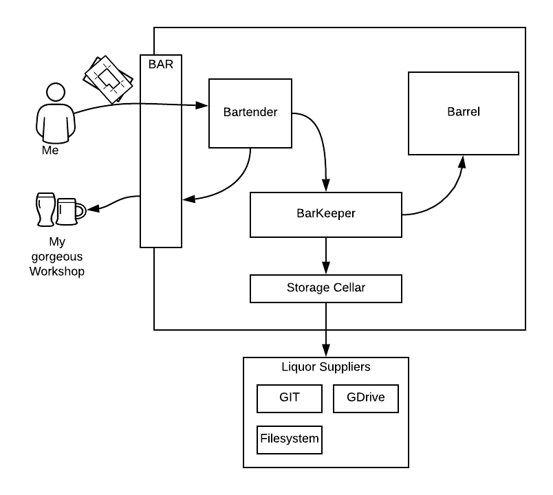
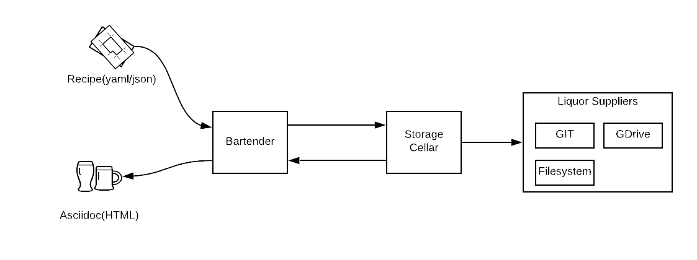

= Workshopper

El objetivo de workshopper es proporcionar facilidades para la creación, reutilización y distribución de laboratorios tipo workshops.

== Arquitectura

La https://www.lucidchart.com/documents/edit/69427313-fb66-4799-b4d4-5836a3584374/R8BgG7O7bO0q#?folder_id=home&browser=icon[arquitectura] está representada en el siguiente diagrama:

=== componentes
*Bartender*: (barto) Proporciona servicios para el atender BAR

*Barkeeper*: TBD

*Storage Cellar*: Gestiona y conoce a los repositorios externos en los que se alojan los contenidos 

*Liquor suppliers*: TBD

*Barrel*:  TBD

*Bar*: Interfaz web para consumo del usuario final

== MVP 1

El primer objetivo es crear los primeros componentes funcionales dados en el siguiente diagrama del https://www.lucidchart.com/documents/edit/69427313-fb66-4799-b4d4-5836a3584374/V9bYfhHvKJ0g#?folder_id=home&browser=icon[MVP1]

